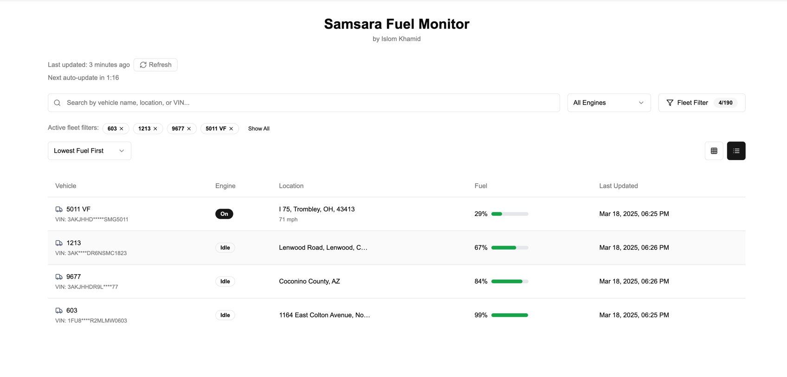

# Samsara Fuel Monitor

Samsara Fuel Monitor is a fleet management dashboard designed to track fuel levels, engine status, and locations of vehicles in real-time. This project provides a user-friendly interface to monitor and filter vehicle data efficiently.



## Features

- **Real-time fuel monitoring**: Displays fuel levels of each vehicle.
- **Engine status tracking**: Indicates whether a vehicle's engine is on, idle, or off.
- **Location tracking**: Shows the current location of vehicles.
- **Fleet filtering**: Users can filter vehicles based on fleet IDs.
- **Sorting options**: Sorts vehicles by fuel levels (lowest first, etc.).
- **Auto-refresh**: Updates data at regular intervals.

## Installation

To run the project locally, follow these steps:

1. Clone the repository:
   ```bash
   git clone https://github.com/your-username/samsara-fuel-monitor.git
   cd samsara-fuel-monitor
   ```
2. Install dependencies:
   ```bash
   npm install
   ```
3. Start the development server:
   ```bash
   npm run dev
   ```

## Usage

1. Open the dashboard in your browser.
2. Use the search bar to find vehicles by name, location, or VIN.
3. Filter fleets using the fleet filter dropdown.
4. Sort vehicles by fuel level or other criteria.
5. Click the refresh button to manually update data.

## Technologies Used

- **React, shadcn, Next.js, TypeScript** 
- **API Integration**: Samsara API for vehicle data
- **Styling**: Tailwind CSS

## API Integration

The dashboard integrates with the **Samsara API** to fetch real-time vehicle data. Ensure you have a valid API key set up in your `.env` file:

```env
# .env

SAMSARA_API_TOKEN=your_api_key_here
```


## Contact

For any questions or contributions, reach out to **Islom Khamid** via GitHub or email at `islomkhodja@gmail.com`.
